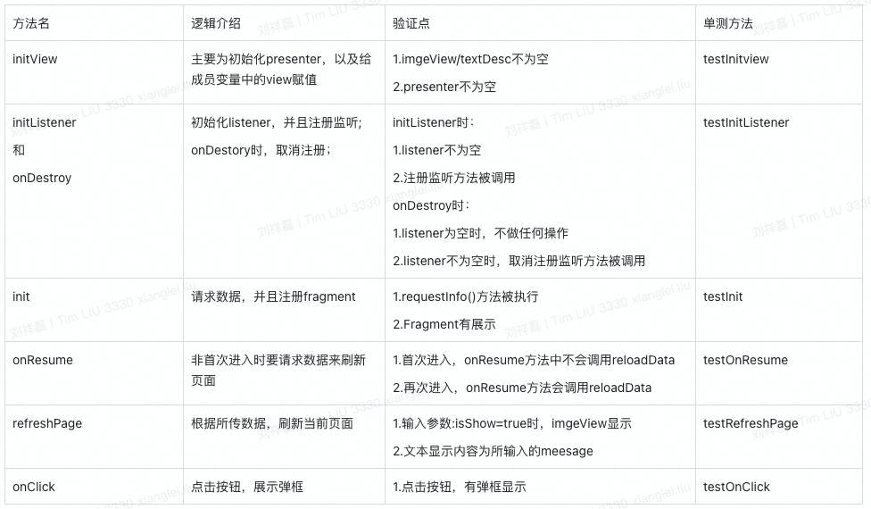

# RobolectricDemo
## 项目介绍
一个使用Robolectric完成所有单元测试的项目，企业级脱敏开源项目，供同样搞单测的小伙伴参考。

## 前言
作者本人目前在一家车载企业负责基础项目的搭建，最近负责搭建所在企业的单元测试框架。
一开始尝试
发现虽然网上单元测试的项目或者文章众多，但是很少又可用的，其原因，就是因为项目结构偏简单无法支撑起企业级项目复杂的结果，或者相关的文章太老，已经失去了参考的意义。


# 一.单元测试介绍
目前，跑在JVM虚拟机上的单测方案主要是Robolectric，而且这也是google官方推荐的一种单元测试的方案。  
单元测试是针对单个方法或类的，自然要排除掉相关的依赖，因此mock工具也是必不可少的。 mock的方案有很多面，主要有以下两种：  
mockito：基于cglib的动态代理实现的，可以mock掉替换掉类中的方法，构造方法，静态方法。  
powermock：mockito的增强版本，基于JDK动态代理的方式，所以可以实现任何的替换。但是缺点是需要替换原有的运行注解，会导致跑单测有问题，而且很久不维护了。  
作者在实际使用中，发现powermock会对Robolectric的单测运行产生一些影响，并且由于mockito也已经支持了静态方法的mock，所以，最终放弃使用powermock。

# 二.单测规范
采用类对类，方法对方法的规范。  
1.如果需要对MainActivity写单元测试，则需要在test文件夹下，相同包名，创建MainActivityTest的单元测试类。  
单元测试类的类名为：原类名+Test。  


2.方法对方法。针对某个方法写代码单测，推荐使用一对一的场景。  
比如针对updateErrorIv方法写单元测试，则单元测试的方法为：testIvErrorState()  
当然，涉及到某些具体相关的业务，会出现多个方法对应一个单元测试方法的情况，这种情况也是完全可以的。

# 三.配置流程
## 1.gradle版本
gradle版本并不是强制要求，只是方便读者更方便的运行本项目。
gradle-wrapper.properties中配置gradle-6.7.1-all版本。   
`distributionUrl=https\://services.gradle.org/distributions/gradle-6.7.1-all.zip`
项目中build.gradle配置版本如下：
```
buildscript {
    dependencies {
        classpath "com.android.tools.build:gradle:4.2.2"
    }
}
```
## 2.依赖配置
app目录下的build.gradle下，配置如下依赖：
```
    testImplementation('junit:junit:4.13.2') {
        exclude group: 'org.hamcrest', module: 'hamcrest-core'
    }
    testImplementation "io.mockk:mockk:1.12.2"
    testImplementation "org.assertj:assertj-core:3.22.0"
    testImplementation "org.robolectric:robolectric:4.9.2"
    testImplementation('org.mockito:mockito-core:3.6.28') {
        exclude group: 'net.bytebuddy', module: 'byte-buddy'
        exclude group: 'net.bytebuddy', module: 'byte-buddy-agent'
    }
    testImplementation 'org.mockito:mockito-inline:5.2.0'
    testImplementation "androidx.test:core:1.3.0"

    testImplementation("org.hamcrest:hamcrest-core:1.3")
    testImplementation("org.assertj:assertj-core:2.6.0")
    testImplementation 'android.arch.core:core-testing:1.0.0-alpha3'
```

## 3.创建单元测试类
创建单元测试类，@Before代表执行前的初始化操作。@Test代表执行单元测试操作。
```
@RunWith(RobolectricTestRunner.class)
public class MainActivityTest {
    @Before
    public void init() {
        APIMock.isUnitTest = true;
    }
    
    @Test
    public void testAny() {
    
    }
}
```

# 四.单测样例介绍
## MVP模式
**相关代码：** 
[mvp](https://github.com/aa5279aa/RobolectricDemo/blob/main/app/src/main/java/com/xt/robolectricdemo/mvp)

**页面功能介绍：**  
1.进入页面，注册自定义监听，退出页面，取消注册自定义监听。  
2.首次进入或者回到页面的时候，请求数据并刷新页面，并且只请求一次。
3.展示fragment。
4.点击图标，会弹出dialog。


### Activity单元测试介绍
**相关代码：** 
[MVPActivity.java](https://github.com/aa5279aa/RobolectricDemo/blob/main/app/src/main/java/com/xt/robolectricdemo/mvp/MVPActivity.java)

**页面代码逻辑梳理：**  
1.init()方法，里面主要做了5个逻辑。检查权限/调用presenter.getHomeInfo()方法/展示OrderListNewFragment页面/注册监听/更新图标。   
2.onResume()方法，首次进入，不执行reloadData()，而后续调用onResume，则执行reloadData()。  
3.getInfoAgain()方法，如果presenter为空，则不执行，不为空，则执行presenter.getHomeInfo()。  
4.initDataListener()方法，进入页面时注册监听。  
5.onDestroy方法，退出时取消注册监听。  
6.testUpdateErrorIv()方法，根据状态显示不同的图标。

汇总整理后，方法和验证点如下：


###  presenter单元测试介绍
**相关代码：** 
[MVPPresenter.java](https://github.com/aa5279aa/RobolectricDemo/blob/main/app/src/main/java/com/xt/robolectricdemo/mvp/MVPPresenter.java)

**presenter逻辑梳理：**  
1.onAttach方法进行页面绑定，验证点为：mView不为空。
2.requestInfo方法发起请求，返回值会调用processInfoAndRefreshPage方法进行刷新。验证点为：1.发起请求：getDataInfo发起请求；2.调用processInfoAndRefreshPage方法；
3.processInfoAndRefreshPage方法逻辑。，如果presenter为空，则不执行，不为空，则执行presenter.getHomeInfo()。  


# 五.常见问题
## 5.1常见问题汇总
### 1.类中引用SO问题
因为单元测试基于JVM虚拟机，执行的是java的流程，并不会执行相关的安卓打包流程，所以引用的SO文件不会打包进最终产物当中，因此，直接运行项目，会提示SO找不到。
所以，更合适的方式是把相关的类进行mock替换掉。

如果遇到业务使用到了SO文件，则需要进行对这个对象进行mock，解除依赖。
比如，我们Model层获取数据时，使用到了SO。
```
	public class MVPPresenter{
	    @Override
	    public void requestInfo() {
		//请求数据，订阅，并显示
		Consumer<InfoModel> consumer = this::processInfoAndRefreshPage;
		Flowable<InfoModel> observable = DataSource.getInstance().getDataInfo();
		Disposable disposable = observable
			.subscribeOn(Schedulers.io())
			.observeOn(AndroidSchedulers.mainThread())
			.subscribe(consumer);
	    }	
    	}
	public class DataSource{
		public Flowable<InfoModel> getDataInfo() {
			//this us jni
			Java2CJNI java2CJNI = new Java2CJNI();
			Log.i("SoView", java2CJNI.java2C());
			return Flowable.create(emitter -> {
			    InfoModel infoModel = new InfoModel();
			    infoModel.status = 100;
			    infoModel.statusDesc = "fail";
			    emitter.onNext(infoModel);
			}, BackpressureStrategy.BUFFER);
		    }
	}
    
```
则我们可以通过mock对象MVPPresenter或DataSource来实现，从而避免请求到真正的getDataInfo()方法。
相关单测代码如下：
```
        MVPPresenter mockPresenter = mock(MVPPresenter.class);
        Mockito.doAnswer(invocation -> {
            //do nothing
            return null;
        }).when(mockPresenter).requestInfo();
```

### 2.解决XML中View类引用SO问题
如果XML引用了某个View的类，并且这个类使用到了SO，则需要整体这个View类。
比如：SoView中使用到了SO文件。
则会产生如下报错，因为
```
Caused by: java.lang.UnsatisfiedLinkError: no Java2C in java.library.path: [/Users/xxxx/Library/Java/Extensions, /Library/Java/Extensions, /Network/Library/Java/Extensions, /System/Library/Java/Extensions, /usr/lib/java, .]
	at java.base/java.lang.ClassLoader.loadLibrary(ClassLoader.java:2670)
```
我们要整体替换掉这个使用SoView的类。
首先，创建SoViewMock类，参考：[创建SoViewMock类.java](https://github.com/aa5279aa/RobolectricDemo/blob/main/app/src/main/java/com/xt/robolectricdemo/mvp/MVPActivity.java)
其次，单元测试类中进行响应的配置，替换掉SoView类。相关代码如下：
```
@Config(shadows = {SoViewMock.class}, manifest = Config.NONE, sdk = Build.VERSION_CODES.P)
```


### 3.解决Activity中成员变量mock问题
我们Activity对象，一般要使用Robolectric构造的，而不能直接new，否则会不走Activity的生命周期。
但是Activity中的成员变量，则需要使用mock的，因为只有mock的才能进行执行次数以及其它相关的验证，所以，如何替换Activity中的成员变量，就是一个我们要解决的问题。
经过反复的尝试，最终发现了一个可行的方案，即MainActivity的onCreate()中经过handler转发后再使用成员变量进行相关操作，我们在观察到执行完onCreate()方法后，使用mock对象替换原始对象。
```
//原始类
public class MVPActivity extends Activity{
	protected void onCreate(@NonNull Bundle savedInstanceState) {
		new Handler().post(() -> {
			...使用成员变量进行相关操作
			presenter.requestInfo();
		};
	}
}

//单元测试类
@RunWith(RobolectricTestRunner.class)
public class MVPActivityTest {
	@Test
    	public void testMethod() {
		ActivityController<MVPActivity> controller = Robolectric.buildActivity(MVPActivity.class);
		MVPPresenter mockPresenter = mock(MVPPresenter.class);
		MVPActivity mainActivity = controller.create().start().get();
		//替换presenter操作
        	mainActivity.presenter = mockPresenter;
		controller.postCreate(null).resume().visible().topActivityResumed(true);
		//避免主线程looper阻塞
		ShadowLooper shadowLooper = ShadowLooper.getShadowMainLooper();
            	shadowLooper.runToEndOfTasks();
		//验证操作
		verify(mockPresenter, times(1)).requestInfo();
	}
}

```
这样，我们通过使用mock的presenter替换原有Activity中的presenter，从而方便我们对presenter中的相关方法进行验证，并且还不影响Activity的生命周期。

### 4.解决单例类的mock问题
虽然我们可以使用第一种的方案去mock整个单例类，但是这种mock的类，是不方便替换其中的方法。所以，对于单例类，我们可以使用替换getInstance方法的方式来进行替换。
这里以DataAdapaterClient为例，相关类结构如下：
```
public class DataAdapaterClient {

    Map<String, DataChangedListener> listenerMap = new HashMap<>();

    public static DataAdapaterClient getInstance() {
        return DataAdapaterClient.SingletonHolder.SINGLETON;
    }

    private static class SingletonHolder {
        private static final DataAdapaterClient SINGLETON = new DataAdapaterClient();

        private SingletonHolder() {
        }
    }
 }
```
我们可以通过mock生成DataAdapaterClient对象，然后通过hook掉静态方法getInstance()，实现每次返回的都是我们mock后的ataAdapaterClient对象。相关代码如下：
```
        DataAdapaterClient mockClient = mock(DataAdapaterClient.class);
        try (MockedStatic<DataAdapaterClient> ignored2 = mockStatic(DataAdapaterClient.class)) {
            when(DataAdapaterClient.getInstance()).thenReturn(mockClient);
	}
```


## 5.2 常见排查手段
1.使用GPT  
2.百度/google
3.参照网上现有的项目，比如：https://github.com/ankidroid/Anki-Android


# 六.参考文档
| 地址                                                                              | 介绍                                                            |
|---------------------------------------------------------------------------------|---------------------------------------------------------------|
| https://github.com/ankidroid/Anki-Android                                       | github上单测覆盖率最高的项目                                             |
| https://github.com/mockito/mockito                                              | github上mockito项目                                              |
| https://github.com/robolectric/robolectric                                      | github上robolectric项目                                          |
| https://github.com/powermock/powermock                                          | github上powermock项目                                            |
| https://developer.android.com/reference/androidx/test/core/app/ActivityScenario | 官方关于ActivityScenario的介绍ActivityScenario用于替代ActivityController |


